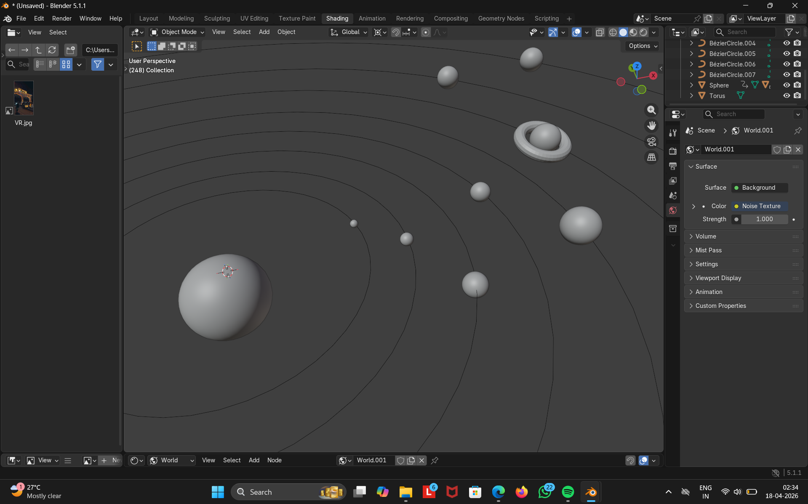

# 🌌 Final 3D Solar System Project

## 📌 Project Overview
This project is a simple 3D solar system created using Blender. It includes the Sun and planets placed along orbit paths.

## 🎯 Features
- Sun and planets using spheres
- Orbit paths
- Basic colors and materials

## 🛠 Tools Used
- Blender

## 📚 Learning
- Learned 3D modeling basics
- Applied materials
- Scene setup

## 📸 Project Preview

